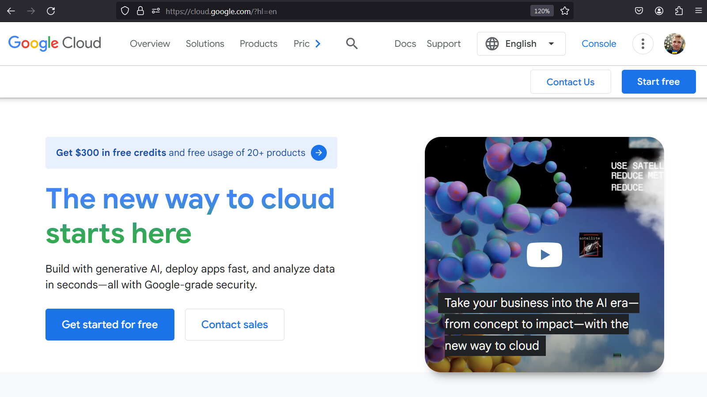
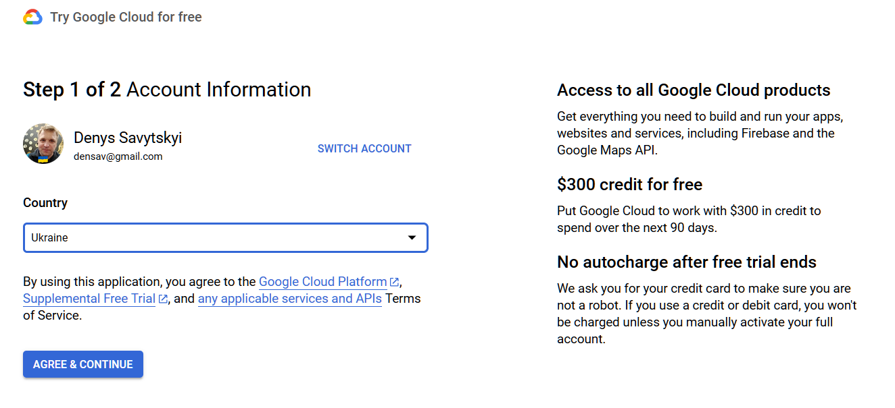

## Deployment to Cloud

This manual is for using cloud services of [Google Cloud platform (GCP)](https://cloud.google.com/?hl=en).

# Deployment using Google Cloud App Engine

In this manual we will go step-by-step with the process of deploying web flask application to Google Cloud App Engine. We will use Standard Environment of App Engine, and configure our app for minimal resource usage. 

## Overview:

1. Create account and login to GCP
2. Prepare your application for deployment to Google Cloud App Engine
3. Enter Google Cloud Shell
4. Clone your project with Git
5. Enter project folder and check context
6. App Engine Deployment
7. Visit just created endpoint of your application
8. Explore Google Cloud App Engine Console with information and logs
9. Shutting application down (optional)

## Advanced topics:
1. Storage options
2. CD/CI

## 1. Create account and login to GCP

Go to the [Google Cloud Platform](https://cloud.google.com/) site.

Press "Get started for free" and follow the registration process.

You will need to enter your personal data, and credit card for validation, no money will be charged.

**NOTE:** on payments and costs: GCP it requires you credit card to register. It offers [3 month free use, and 300$ credits](https://cloud.google.com/free/docs/free-cloud-features). After free use ends you will not be charged, unless you willingly switch to paid account. So before 3 month trial ends you have nothing to worry about. 

After that, if you switch to paid there is some thing you need to know: there is a so called [free tier](https://cloud.google.com/free/docs/free-cloud-features), thar offer a considerable amount of services for free. For example it offer running of F1 machine, that we will use for our App Engine Deployment, for total of 28 hours per day.  Having pet project hosted with low performance options costs little, but you have to be careful. By mistake on unknowing you may switch on some costly service you can get charged, so what you should do is set the budget limit in the cloud for example for $1 - %5, so if you reach this amount you will receive e-mail with notification. Setting a budget limit will be shown in the guide video. 

## 2. Prepare your application for deployment to Google Cloud App Engine

## 3. Enter Google Cloud Shell

## 4. Clone your project with Git

## 5. Enter project folder and check context

## 6. App Engine Deployment

## 7. Visit just created endpoint of your application

## 8. Explore Google Cloud App Engine Console with information and logs

## 9. Shutting application down (optional)

# Advanced topics:

## 1. Storage options

## 2. CD/CI