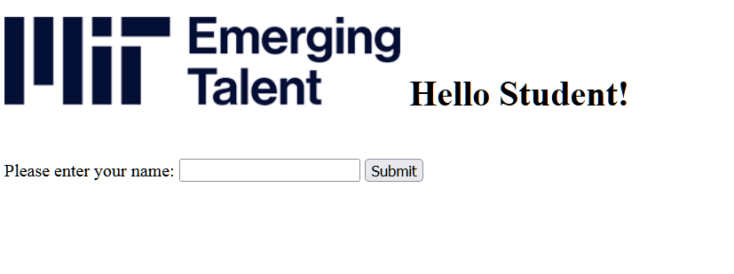

# Cloud Workshop

## Info

This is a repository for Cloud Workshop, that will be presented as a part of MIT Emerging Talent program.

## Summary

This workshop assumes that listeners have a good knowledge of Python and computation but basic knowledge of cloud computing and networking. It aims to provide an overview of networking and cloud technologies. Workshop incudes a practical part, that will show participants how they could deploy their applications using the demonstrated approach.

## Objectives

1. Provide an overview of cloud technologies, compare to on-prem systems. We will start with basic basis of network and internet functionality, 7 layers network protocol in short and general info on how application layers works, what is HTTP Request and Response, basic info on methods, like GET, POST. Then will follow short history of evolution of clouds, types of services cloud provide (IaaS, PaaS, SaaS) and introduction to the most popular services, and how they are used in development and production. This will cover: 
    - Computing (VM, Containers, Functions, Kubernetes)
    - Storage (File and object storage, SQL)
    - Networking
    - Machine Learning and AI
    - Other services

2. Practical part. We will demonstrate cloud on example of Google Cloud. Practical part will include:
    - Short introduction to sample application, Flask overview, and running app from local PC
    - Flowing steps of deployment: creating a VM, starting it, copying application, installing packages, running app with gunicorn (package to run flask in production), running gunicorn as service in VM, reaching the app through the VM external IP

## This Repository contains

- README.md - Index / this file
- [Agenda](Agenda.md)
- [Slides](slides)
- [Helloworld application](helloworld) 
- Deployment - notes and scripts for the practical part

## [Helloworld Application](helloworld)

Simple web application on flask with "Hello world!", and a form input field for username. "Submit" button sends a POST request with name, resulting in a "Hello \<Username\>!" response. Name is modified using str.title() method, capitalizing name, for basic functionality.
Includes python file, html template and a image, in subfolder. This tiny additions will help to get a better picture of deployment. 

## Deployment

VM: the simplest VM in GPC, that will require constant run of the python code + gunicorn for running a flask.

